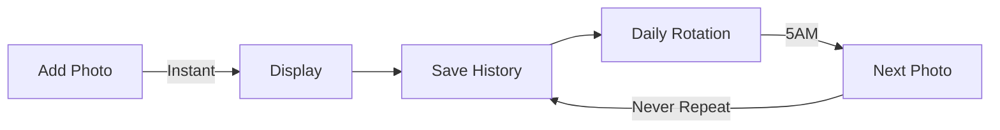

# 🖼️ Inky Photo Frame

<div align="center">


**Transform your Inky Impression 7.3" into a stunning digital photo frame**

[](https://github.com/mehdi7129/inky-photo-frame)
[](LICENSE)
[](https://www.raspberrypi.org/)
[](https://shop.pimoroni.com/products/inky-impression-7-3)

[**📥 Quick Install**](#-quick-installation) • [**📱 Phone Setup**](#-upload-photos-from-your-phone) • [**🔧 WiFi Config**](#-smart-wifi-configuration) • [**📖 Full Guide**](INSTALLATION_GUIDE.md)

</div>

---

## ✨ What Makes It Special?

<table>
<tr>
<td width="50%">

### 🎨 **Beautiful E-Ink Display**
- **800x480 pixels** - Crystal clear
- **7 colors** - Vibrant Spectra display
- **No backlight** - Easy on the eyes
- **Persistent** - Image stays without power

</td>
<td width="50%">

### 🔋 **Ultra Low Power**
- **0.6W average** - Less than an LED bulb
- **Zero power** when displaying
- **10x more efficient** than LCD frames
- **< 1€/year** electricity cost

</td>
</tr>
</table>

## 📸 Features at a Glance

<div align="center">

| Feature | Description |
|---------|------------|
| 📲 **Instant Display** | New photos appear immediately when added |
| 🔄 **Smart Rotation** | Daily change at 5AM with intelligent history |
| 📱 **Universal** | Works with iPhone, Android, any smartphone |
| 🔵 **Smart Bluetooth** | 10-minute WiFi setup window after boot |
| 🖼️ **HEIC Support** | Native support for modern phone formats |
| ✂️ **Smart Cropping** | Automatic optimization for e-ink |

</div>

## 🚀 Quick Installation

### One-Line Install
```bash
curl -sSL https://raw.githubusercontent.com/mehdi7129/inky-photo-frame/main/install.sh | bash
```

That's it! The installer handles everything:
- ✅ Dependencies
- ✅ SMB file sharing
- ✅ Auto-start on boot
- ✅ Bluetooth configuration

## 📱 Upload Photos from Your Phone

<table>
<tr>
<td width="50%" align="center">

### iPhone / iPad


1. Open **Files** app
2. Tap **Connect to Server**
3. Enter: `smb://[your-pi-ip]`
4. Login: `inky` / `inkyimpression73_2025`
5. Drop photos in **InkyPhotos**

</td>
<td width="50%" align="center">

### Android


1. Install **CX File Explorer**
2. Add network location (SMB)
3. Enter: `smb://[your-pi-ip]`
4. Login: `inky` / `inkyimpression73_2025`
5. Upload to **InkyPhotos**

</td>
</tr>
</table>

## 🎯 How It Works

<div align="center">

</div>

### Welcome Screen
When first powered on, the display shows:
- 📍 Your Raspberry Pi IP address
- 🔐 Login credentials
- 📝 Step-by-step instructions

### Smart Photo Management


## 🔧 Smart WiFi Configuration

**Lost WiFi? No SSH needed!**

1. 🔌 **Reboot** your Raspberry Pi
2. 📱 **Connect** via Bluetooth within 10 minutes
3. ⚙️ **Configure** new WiFi settings
4. 🔋 **Auto-shutdown** Bluetooth after 10 min (saves energy!)

## 📦 What You Need

<table>
<tr>
<td align="center">


**Inky Impression 7.3"**

[Buy from Pimoroni](https://shop.pimoroni.com/products/inky-impression-7-3)

</td>
<td align="center">


**Raspberry Pi Zero 2 W**

Works with Zero 2W, 3, 4, or 5

</td>
<td align="center">


**Power Supply & SD Card**

8GB+ SD card recommended

</td>
</tr>
</table>

## 🌟 Perfect For

- 🎁 **Personalized Gifts** - Load family photos before gifting
- 🏠 **Home Decoration** - Modern, minimalist design
- 👵 **Grandparents** - Simple to use, no tech knowledge needed
- 🌱 **Eco-Friendly** - Ultra-low power consumption
- 🎓 **Educational** - Learn about e-ink technology

## 📊 Power Consumption Comparison

<div align="center">

| Device | Power Usage | Annual Cost |
|--------|------------|-------------|
| **Inky Photo Frame** | 0.6W | < 1€ |
| iPad Photo Frame | 2-3W | ~4€ |
| LCD Digital Frame | 5-10W | ~13€ |
| LED Light Bulb | 7W | ~9€ |

</div>

## 🛠️ Advanced Configuration

Edit `/home/pi/inky-photo-frame/inky_photo_frame.py`:

```python
CHANGE_HOUR = 5  # Change daily at this hour (24h format)
PHOTOS_DIR = Path('/home/pi/InkyPhotos')  # Photo storage location
```

## 📝 Commands

```bash
# Check status
sudo systemctl status inky-photo-frame

# View logs
sudo journalctl -u inky-photo-frame -f

# Restart service
sudo systemctl restart inky-photo-frame

# Manual test
python3 /home/pi/inky-photo-frame/inky_photo_frame.py
```

## 🤝 Contributing

Contributions are welcome! Feel free to:
- ⭐ Star this repo
- 🐛 Report bugs
- 💡 Suggest features
- 🔀 Submit pull requests

## 📄 License

MIT License - Feel free to use and modify!

## 🙏 Acknowledgments

- [Pimoroni](https://pimoroni.com) for the amazing Inky display
- Built with ❤️ for the Raspberry Pi community
- Powered by Python and e-ink technology

---

<div align="center">

**Made with 🖼️ by [mehdi7129](https://github.com/mehdi7129)**

[⬆ Back to top](#️-inky-photo-frame)

</div>