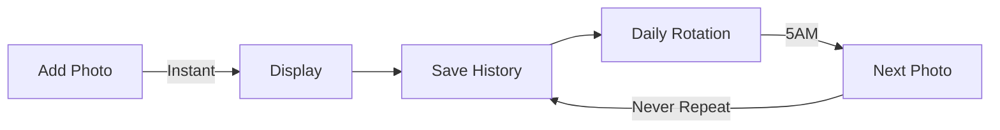

# 🖼️ Inky Photo Frame

<div align="center">

## 🖼️ Universal E-Ink Photo Frame • Auto-Detects Your Display

**Transform your Inky Impression into a stunning digital photo frame**

[](https://github.com/mehdi7129/inky-photo-frame)
[](LICENSE)
[](https://www.raspberrypi.org/)
[](https://shop.pimoroni.com/products/inky-impression-7-3)

[**📥 Quick Install**](#-quick-installation) • [**📱 Phone Setup**](#-upload-photos-from-your-phone) • [**🔧 WiFi Config**](#-smart-wifi-configuration) • [**📖 Full Guide**](INSTALLATION_GUIDE.md)

</div>

---

## 🎯 Compatible Displays

This project **automatically detects** and adapts to your Inky display:

| Model | Resolution | Aspect Ratio | Colors | Status |
|-------|------------|--------------|---------|---------|
| **Inky Impression 7.3"** | 800×480 | 5:3 | 7 colors | ✅ Fully Supported |
| **Inky Impression 7.3" (2025)** | 800×480 | 5:3 | 6 colors | ✅ Fully Supported |
| **Inky Impression 13.3" (2025)** | 1600×1200 | 4:3 | 6 colors | ✅ Fully Supported |

The software uses the official [Pimoroni Inky library](https://github.com/pimoroni/inky) with `inky.auto` for automatic display detection!

## ✨ What Makes It Special?

### 🎨 **Beautiful E-Ink Display**
- **Auto-adapts** to your display resolution
- **Multi-color** support (6-7 colors depending on model)
- **No backlight** - Easy on the eyes
- **Persistent** - Image stays without power

### 🔋 **Ultra Low Power**
- **0.6W average** - Less than an LED bulb
- **Zero power** when displaying
- **10x more efficient** than LCD frames
- **< 1€/year** electricity cost

## 📸 Features at a Glance

| Feature | Description |
|---------|------------|
| 📲 **Instant Display** | New photos appear immediately when added |
| 🔄 **Smart Rotation** | Daily change at 5AM with intelligent history |
| 📱 **Universal** | Works with iPhone, Android, any smartphone |
| 🔵 **Smart Bluetooth** | 10-minute WiFi setup window after boot |
| 🖼️ **HEIC Support** | Native support for modern phone formats |
| ✂️ **Smart Cropping** | Automatic optimization for e-ink |

## 🚀 Quick Installation

### One-Line Install
```bash
curl -sSL https://raw.githubusercontent.com/mehdi7129/inky-photo-frame/main/install.sh | bash
```

That's it! The installer handles everything:
- ✅ Enables I2C and SPI (required for display)
- ✅ Dependencies
- ✅ SMB file sharing
- ✅ Auto-start on boot
- ✅ Bluetooth configuration

## 📱 Upload Photos from Your Phone

### iPhone / iPad
1. Open **Files** app
2. Tap **Connect to Server**
3. Enter: `smb://[your-pi-ip]`
4. Login: `inky` / `inkyimpression73_2025`
5. Drop photos in **Images**

### Android
1. Install **CX File Explorer** or **Solid Explorer**
2. Add network location (SMB)
3. Enter: `smb://[your-pi-ip]`
4. Login: `inky` / `inkyimpression73_2025`
5. Upload to **Images**

## 🎯 How It Works

### Welcome Screen
When first powered on, the display shows:
- 📍 Your Raspberry Pi IP address
- 🔐 Login credentials
- 📝 Step-by-step instructions

### Smart Photo Management


## 🔧 Smart WiFi Configuration

**Lost WiFi? No SSH needed!**

1. 🔌 **Reboot** your Raspberry Pi
2. 📱 **Connect** via Bluetooth within 10 minutes
3. ⚙️ **Configure** new WiFi settings
4. 🔋 **Auto-shutdown** Bluetooth after 10 min (saves energy!)

## 📦 What You Need

- **🖼️ Inky Impression Display** - Any model:
  - [Inky Impression 7.3"](https://shop.pimoroni.com/products/inky-impression-7-3)
  - [Inky Impression 7.3" (2025 Edition)](https://shop.pimoroni.com/products/inky-impression-7-3-2025)
  - [Inky Impression 13.3" (2025 Edition)](https://shop.pimoroni.com/products/inky-impression-13-3-2025)
- **🥧 Raspberry Pi** - Zero 2W, 3, 4, or 5
- **🔌 Power Supply** - 5V USB power
- **💾 SD Card** - 8GB+ recommended
- **📶 WiFi Network** - For photo uploads

## 🌟 Perfect For

- 🎁 **Personalized Gifts** - Load family photos before gifting
- 🏠 **Home Decoration** - Modern, minimalist design
- 👵 **Grandparents** - Simple to use, no tech knowledge needed
- 🌱 **Eco-Friendly** - Ultra-low power consumption
- 🎓 **Educational** - Learn about e-ink technology
- ⛺ **Portable/Outdoor** - Works on battery for weeks!

## 🔋 Battery Life & Power Consumption

### Power Usage Breakdown
| Component | Consumption | Notes |
|-----------|------------|-------|
| **Raspberry Pi Zero 2W** | 0.5-0.75W | Idle with WiFi |
| **E-ink Display Refresh** | 1W for 30s | Once per day |
| **Average Total** | **0.6W** | 24/7 operation |

### Estimated Battery Life
| Battery Capacity | Estimated Runtime | Usage Pattern |
|-----------------|-------------------|---------------|
| **10,000 mAh** | **~3-4 days** | WiFi always on, 1 change/day |
| **20,000 mAh** | **~7-8 days** | WiFi always on, 1 change/day |
| **26,800 mAh** | **~10-12 days** | WiFi always on, 1 change/day |
| **10,000 mAh** | **~30+ days** | WiFi off, pre-loaded photos |

*Note: E-ink displays consume ZERO power between refreshes!*

### Annual Cost Comparison
| Device | Power Usage | Annual Cost |
|--------|------------|-------------|
| **Inky Photo Frame** | 0.6W | < 1€ |
| iPad Photo Frame | 2-3W | ~4€ |
| LCD Digital Frame | 5-10W | ~13€ |
| LED Light Bulb | 7W | ~9€ |

## 🛠️ Advanced Configuration

### Change Photo Rotation Time
Edit `/home/pi/inky-photo-frame/inky_photo_frame.py`:

```python
CHANGE_HOUR = 5  # Change daily at this hour (24h format)
PHOTOS_DIR = Path('/home/pi/Images')  # Photo storage location
```

### Adjust Color Saturation
Adjust the color intensity of your display (0.0 = B&W, 1.0 = maximum colors):

```bash
# Set saturation to 0.8 for more vibrant colors
ssh pi@[your-pi-ip] "sed -i 's/saturation=0.6/saturation=0.8/g' /home/pi/inky-photo-frame/inky_photo_frame.py && sudo systemctl restart inky-photo-frame"

# Or set to any value between 0.0 and 1.0
# Default: 0.6 (balanced colors)
# Recommended values:
# - 0.4: Subtle, pastel colors
# - 0.6: Balanced (default)
# - 0.8: Vibrant colors
# - 1.0: Maximum saturation
```

## ⚠️ Troubleshooting

### Display not working?
```bash
# Check if I2C and SPI are enabled
ls /dev/i2c* /dev/spidev*

# If not found, enable them:
sudo raspi-config nonint do_i2c 0
sudo raspi-config nonint do_spi 0
sudo reboot
```

## 📝 Commands

```bash
# Check status
sudo systemctl status inky-photo-frame

# View logs
sudo journalctl -u inky-photo-frame -f

# Restart service
sudo systemctl restart inky-photo-frame

# Manual test
python3 /home/pi/inky-photo-frame/inky_photo_frame.py
```

## 🤝 Contributing

Contributions are welcome! Feel free to:
- ⭐ Star this repo
- 🐛 Report bugs
- 💡 Suggest features
- 🔀 Submit pull requests

## 📄 License

MIT License - Feel free to use and modify!

## 🙏 Acknowledgments

- [Pimoroni](https://pimoroni.com) for the amazing Inky display
- Built with ❤️ for the Raspberry Pi community
- Powered by Python and e-ink technology

---

<div align="center">

**Created by [mehdi7129](https://github.com/mehdi7129)**

[⬆ Back to top](#️-inky-photo-frame)

</div>